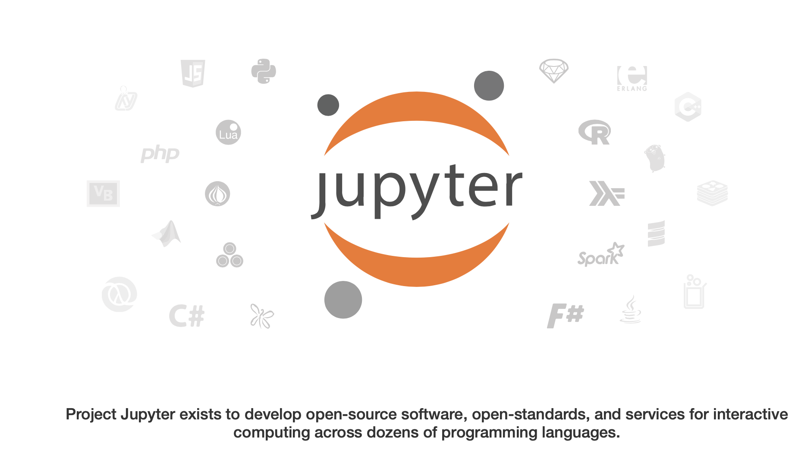
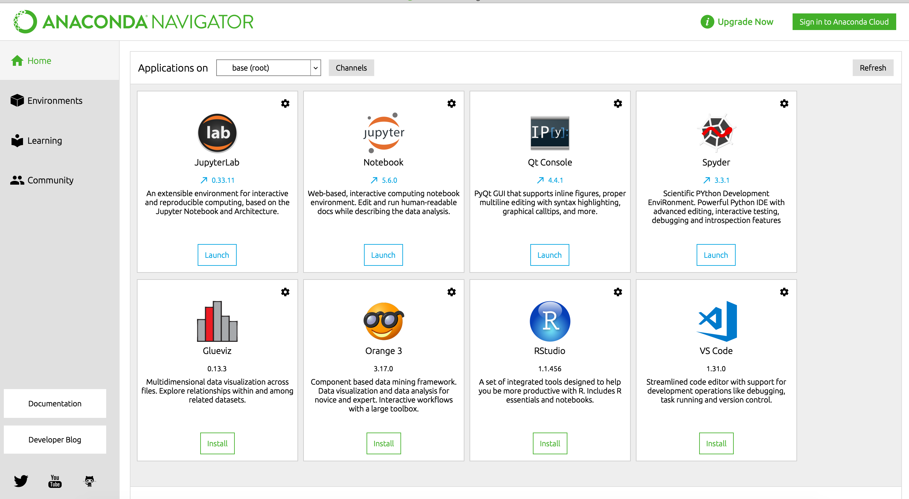

# Jupyter Notebook

Ya hemos hablado de IDEs o los espacios de edición del código de Python. Ahora, vamos a revisar otra herramienta muy util para trabajar con Python de una forma simple.

Hablamos de Jupyter Notebook! Aquí su página oficial: https://jupyter.org

Jupyter es un entorno de trabajo interactivo que permite desarrollar código en Python de manera dinámica, a la vez que integrar en un mismo documento bloques de código como texto, gráficas o imágenes.

### Instalación

Es importante tener Python instalado (recuerdas como instalar Python en tu computadora?, lo vimos en los temas anteriores).

Existen dos formas de instalar Jupyter Notebook en tu computadora, por línea de comando o instalando **Anaconda** desde su página principal.

### Instalando por línea de comando

Abre la terminal para los comandos y escribe:

>

    python3 -m pip install --upgrade pip

Primero debes revisar que tienes la última versión de **pip**, después ya puedes instalar el Jupyter Notebook

    pip3 install jupyter

Listo!  ahora continuando en la linea de comando, puedes escribir el siguiente comando y te mostrará un espacio de trabajo en una página web.

    jupyter notebook

### Instalando Anaconda

Ve directamente a su web oficial:
https://www.anaconda.com/distribution/

Selecciona si utilizas: Mac, Windows o Linux y selecciona también, tu versión de Python, en nuestro caso instalamos la versión de Python 3.

Descarga el archivo y luego con el asistente de instalador, dale "siguiente" y tendrás el programa de Anaconda en tu computadora.

Como ves, en el programa Anaconda, existe la opción de iniciar el Jupyter Notebook.

Independiente del método de instalación de Jupyter Notebook que utilizaste, cuando inicias el notebook (cuaderno), vez algo como esto:

Desde este paso, empezaremos a crear los cuadernos de ejercicios para Python.
