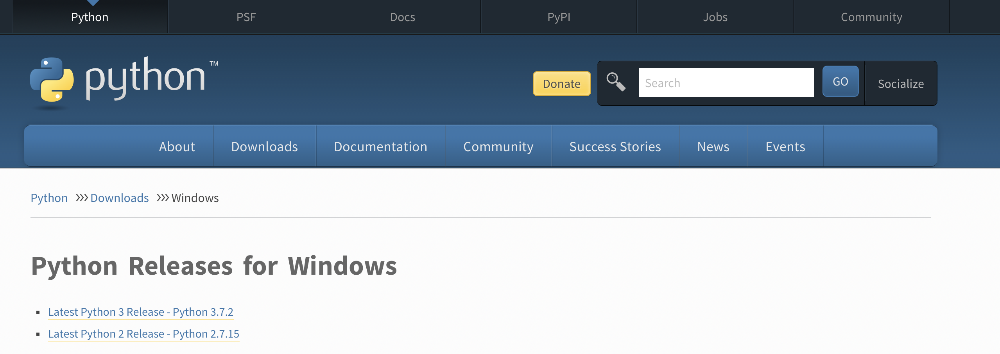
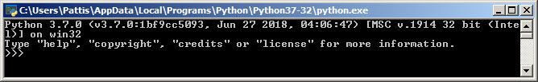

# Primeros pasos en Python

A continuación te presentamos Python como lenguaje de programacion y nuestra herramienta para futuros ejercicios. En este apartado aprenderás:
- Qué es Python
- Cómo se instala
- Características
- Diferencias en relación a otros lenguajes
- Entender y ejecutar código

## 1. Que es python

Python es un lenguaje de programación interpretado cuya filosofía prioriza la escritura de código legible.

La principal diferencia entre un lenguaje compilado y uno interpretado es que el lenguaje compilado requiere un paso adicional antes de ser ejecutado, la compilación, que convierte el código que escribes a lenguaje de máquina.
Un lenguaje interpretado, por otro lado, es convertido a lenguaje de máquina a medida que es ejecutado.

Ejemplos de lenguajes compilados incluyen C, C++, Java, Go y Rust, entre muchos otros. Ejemplos de lenguajes interpretados incluyen Ruby, Python y JavaScript, entre muchos otros. A todos estos lenguajes se les conoce como lenguajes de alto nivel.


El nombre del lenguaje proviene de la afición de su creador original, Guido van Rossum, por los humoristas británicos Monty Python. El principal objetivo que persigue este lenguaje es la facilidad, tanto de lectura, como de diseño.

## 2. Instalación

Para instalar **Python**, nuestra herramienta de trabajo, debes a seguir los siguientes pasos:
1. Identificar el sistema operativo en tu computadora: Windows, Mac, Linux.

###Windows###
Primero comprueba si tu computador tiene una version de Windows de 32-bit o 64-bit, presiona la tecla Windows + Pause/Break, esto abrirá tu System info (información de tu sistema), ahora busta la linea "System type". Puedes descargar Python para Windows desde el sitio web https://www.python.org/downloads/windows/. Haz click en el link "Latest Python 3 release - Python x.x.x.". Si tu computador tiene una versión de Windows de 64 bits, descarga Windows x86-64 executable installer. De lo contrario, descarga Windows x86 executable installer. Después de descargar el instalador, debes ejecutarlo (hazle doble click) y sigue las instrucciones.




Para considerar: Durante la instalación verás una ventana llamada "Setup". Asegúrate de seleccionar la casilla "Add Python 3.x to Path" y luego haz click en "Install Now", como se muestra a continuación:


Para verificar que Python está correctamente instalado, abre la terminal de tu compudora y escribe el comando "python", si este está instalado, verás una respuesta similar a la de la imagen a continuación:




###Mac OS###
Debes ir al sitio web https://www.python.org/downloads/mac-osx/ y descargar el instalador de Python:

* Descargar el archivo Mac OS X 64-bit/32-bit installer


* Selecciona python-3.7.x-macosx.x.pkg para ejecutar al instalador.


###Comprobando que python está instalado###
Escribe "python3 --version" en la línea de comando y verás:
<p>Python 3.6.1</p>

Ya estamos listos para seguir!

## 3. Características

Python es un lenguaje de programación multiparadigma. Esto significa que más que forzar a los programadores a adoptar un estilo particular de programación, permite varios estilos: programación orientada a objetos, programación imperativa y programación funcional.
Alguna de las características más destacadas es el empleo del indentado (tabulaciones) para definir bloques de código en condicionales y bucles, y el uso avanzado que hace de vectores, listas, y textos.

## 4. Usos

Python es un lenguaje de programación de código abierto, orientado a objetos, muy simple y fácil de entender.
Una de las ventajas principales de aprender Python es la posibilidad de crear un código con gran legibilidad, que ahorra tiempo y recursos, lo que facilita su comprensión e implementación.

###Python en Inteligencia Artificial
Python es un lenguaje de escritura rápido, escalable, robusta y de código abierto, ventajas que hacen de Python un aliado perfecto para la **Inteligencia Artificial**.
Permite plasmar ideas complejas con unas pocas líneas de código, lo que no es posible con otros lenguajes.

###Python en Big Data
El uso de Python está muy extendido en el análisis datos y la extracción de información útil para empresas. Además de su simplicidad, que es una gran ventaja, Python cuenta con bibliotecas de procesamiento de datos como ‘Pydoop‘ , que son de gran ayuda para los profesionales.

###Python en Ciencias de datos
Python se ocupa de los datos tabulares, matriciales y estadísticos, e incluso los visualiza con bibliotecas populares como “Matplotlib” y “Seaborn”. Además, cuenta con librerías de apoyo numérico como: ‘Pandas’ y ‘NumPy’.

###Python en Desarrollo Web
Python permite construir mucho más con menos líneas de código, por lo que se crean prototipos de forma más eficiente. El framework Django, proporcionado por Python, es una ventaja para el desarrollo web.

Estos son algunos ejemplos de los usos y aplicaciones donde se utiliza Python.


## 5. Diferencias en relacion a otros lenguajes

A diferencia de los programadores de C, C# o incluso de PHP, aquella gente que ha estado llegando a Python, --como la mayoría que llega a Perl y a Ruby-- lo ha hecho porque disfrutan de programar y buscan un lenguaje que les facilite hacer mejor algo que les gusta.

Este lenguaje recoge lo mejor de otros y es reconocido porque es muy limpio y legible, lo que facilita mucho la tarea de los programadores.


## 6. Diferencias entre Python 2 y 3

En la sección de instalación, pudiste ver que existen diferentes versiones de Python. Entre las más usadas actualmente tenemos la versión 2 (más especificamente la versión 2.7) y la versión 3 (más específicamente la versión 3.7).

El más utilizado este último año para principantes ha sido la versión 3. En la siguiente imagen, verás algunas diferencias entre estas versiones, y revisaremos un poco más a detalles las mismas después.


Por ejemplo, la forma de 'imprimir' o mostrar en pantalla es diferente:

### Python versión 2
```python
print "Hola mundo"
```

### Python versión 3
```python
print('Hola mundo')
```

También el redondeo del resultado en una división matemática:

### Python versión 2
```python
5/2
2
```

### Python versión 3
```python
5/2
2.5
```

## 7. Ejemplos de codigo y su interpretación

A continuación verás algunos ejemplos de código sencillos para ir aprendiendo más de Python.
Se verán temas mucho más detallados en los siguientes capítulos pero a continuación se detallan algunos ejemplos básicos.
Cabe recalcar que el resto de los ejemplos se trabajaran con la version 3 de python.

Para imprimir un número o texto en pantalla, usamos la función Print
```python
print('Hola mundo')
```
Para recibir un texto por el usuario, empleamos la función Input
```python
nombre=input('Introduce tu nombre: ')
```
Si queremos recibir un número, tenemos que convertirlo con la función Int
```python
edad = int(input('Introduce tu edad: '))
```
Las estructuras condicionales se realizan de forma similar a casi todos los lenguajes de programación. Por ejemplo, el siguiente código recibe un número, y dice si es par o impar.
```python
### Introducir un numero por teclado y decir si es par o impar
num = int(input('Introduzca un numero: '))
if num % 2 == 0:
    print('Par')
else:
    print('Impar')
```
El bucle de tipo for si tiene ciertas particularidades. El siguiente ejemplo, muestra como imprimir en pantalla los 10 primeros números
```python
### Ejemplo for, imprime los 10 primeros numeros en una linea
for i in range(10):
    print(i, end=" ") #imprimir numero, sin salto linea
    print() #lineavacia
```
Por su parte, un “equivalente” a un bucle de tipo foreach tendría la siguiente forma.
```python
###Ejemplo foreach, imprime los numeros de la lista del 1 al 4
for i in [1, 2, 3, 4]:
    print(i, end=" ") #imprimir numero, sin salto linea
    print() #lineavacia
```
Si ejecutamos el código en una cadena, se ejecuta la acción para cada letra
```python
### Ejemplo foreach, imprime las letras MENTORHER
for i in "MENTORHER":
    print(i)
```
El bucle while se ejecutaría de la siguiente forma
```python
### Ejemplo while, imprime los primeros 10 numeros
i = 1
while i <= 10:
    print(i)
    i += 1
```
Por último para definir una función usamos la palabra reservada Def. El siguiente ejemplo define una función que calcula el máximo de dos números, y cómo usarla para calcular el máximo entre 20 y 30.
```python
### Ejemplo de función
def max (a, b):
    if a < b:
        return b
    elif b < a:
        return a
    else:
        return a
```
Y para llamar a la función creada ejecutamos:
```python
print(max(20, 30))
```


## 8. Ejecución de código

Felicidades! Hasta este punto, ya sabes qué es Python, cómo funciona y algunas instrucciones básicas para empezar a prácticar!
Ahora veamos, como "ejecutar" o "hacer correr" o "hacer funcionar" un documento que tenga tu código en Python.

Por ejemplo, puedes abrir un editor de notas o notepad en la computadora y escribir:

```python
print('Hola mundo')
```

Guardar ese documento como  **"prueba1.py"**, ahora abre tu línea de comandos y escribe el siguiente comando:

> $ python3 prueba1.py

El documento o archivo donde escribiste tus líneas de código pueden desarrollarse en un ambiente diferente, en un IDE (entorno de trabajo), de cuál hablamos en el siguiente punto.

## 9. Entornos de trabajo (IDE)
Existen varios IDEs para programar con python, entre los cuales los mas relevantes son:
* PyCharm https://www.jetbrains.com/pycharm
* Eclipse + PyDev http://www.pydev.org
* Sublime Text https://www.sublimetext.com
* Atom https://atom.io/
* Visual Studio Code https://code.visualstudio.com/

## 10. Referencias - Documentación importante

Una de las referencias más importantes, la misma página web oficial de Python: https://www.python.org

Entre otras referencias para aprender más detalles de Python como lenguaje de programación, puedes revisar:

* Introducción a Python de las djangogirls https://tutorial.djangogirls.org/es/python_introduction/
* Aprende Python http://www.learnpython.org/en/Welcome
