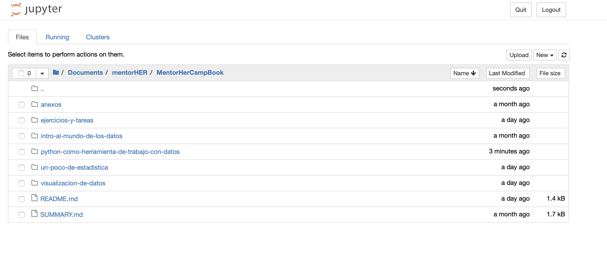
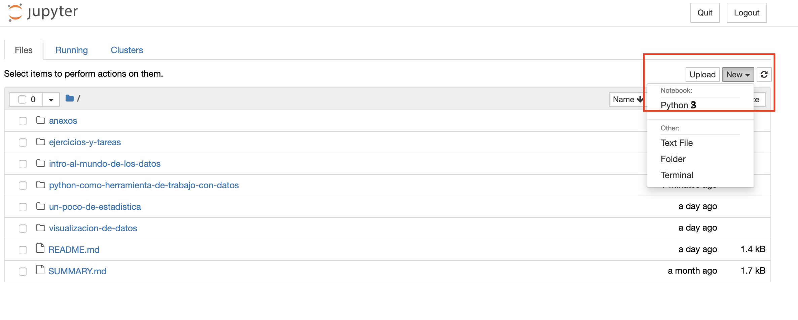
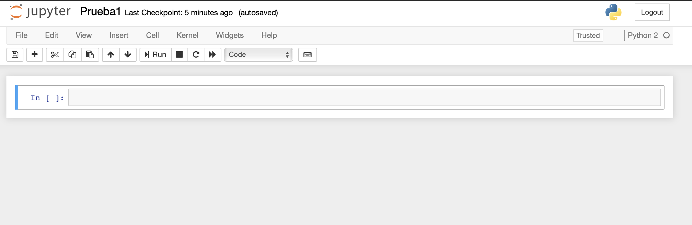

# Trabajemos en un notebook

Ya tenemos Python y Jupyter Notebook instalados en la computadora y estamos listos para empezar a aprender y practicar.

Es hora de iniciar nuestro Jupyter Notebook y empezar a probar nuestro código en Python.

Para crear un nuevo cuaderno o notebook, ve a la parte derecha superior, y selecciona NUEW

Ya tenemos nuestro notebook creado y con nombre asigando. Buen trabajo!

